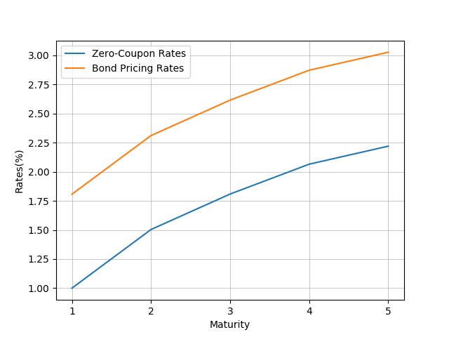

fincomepy
==========

A set of tools to perform fixed income securities related calculation in Python. Products covered:

* Z-spread calculation from zero coupon bond
* Z-spread calculation from par coupon bond
* Bond price, yield and other related calculations
* Repo start payment, end payment, and break even yield
* Bond future's net basis and implied repo rate
* CDS spread

Author
----------

* [Xu Ren](https://github.com/reese3928) (xuren2120@gmail.com)

Usage
----------

### Z-spread calculation from zero coupon bond

|   Maturity |   Zero Coupon Rate |   Coupon Cash Flow |
|-----------:|-------------------:|-------------------:|
|          1 |               1.0% |               3.0% |
|          2 |            1.5038% |               3.0% |
|          3 |            1.8085% |               3.0% |
|          4 |            2.0652% |               3.0% |
|          5 |            2.2199% |             103.0% |

